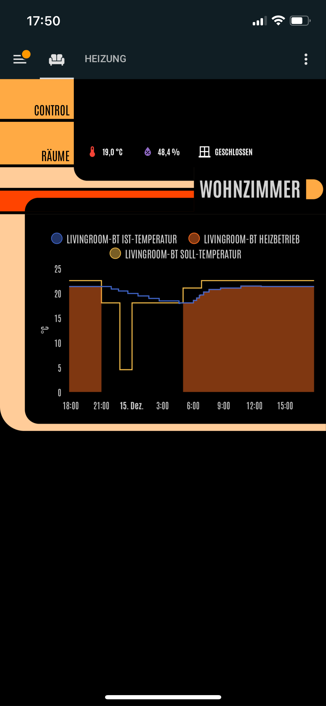

## First of all
a big thank you to the Creators of the components i used to make this possible
- [auto-entities](https://github.com/thomasloven/lovelace-auto-entities)
- [lovelace-card-mod](https://github.com/thomasloven/lovelace-card-mod)
- [scheduler card](https://github.com/nielsfaber/scheduler-card)
- [layout-card](https://github.com/thomasloven/lovelace-layout-card)
- [config-template-card](https://github.com/iantrich/config-template-card)
- [Decluttering Card](https://github.com/custom-cards/decluttering-card)
- [Restriction Card](https://github.com/iantrich/restriction-card)
- [Home Assistant LCARS](https://github.com/th3jesta/ha-lcars)
- [slider-button-card](https://github.com/custom-cards/slider-button-card)
- [lovelace-html-card](https://github.com/PiotrMachowski/lovelace-html-card)
- [linkend-lovelace-ui](https://github.com/daredoes/linked-lovelace-ui)

you can also use this as list which components you nee to install

## Second
- sorry for the mixing of german and english (im from germany but try to name thing english for compatibiltiy but sometimes...)
- im not a huge star trek fan so dont please hit me to hard with hardcore star trek lore 
  - but friendly advice is always welcome
- but i really like the LCARS touch input

## Idea
the main idea ist that linked lovelace and auto-entities create the ui for us.
we have only to set up some labels on entities. (excpet thermostats but that could be a problem in how i want to have some things.)

## Example

### Control


### Config


### statistics


### rooms


in ``example`` are my exact dashboards which work (probably wont work out of the box by you because of some entity names and area names.) 
But with that you can take another look if my explanation is confusing.

## Setup
1. install all the hacs components
2. extend ha-lcars undert ``/config/themes/lcars/lcars.yaml`` see [lcars.yaml](lcars.yaml)
3. setup seperate dashboard for templates (so you can make this visible only for admins if you have multiple user)
   be aware the decluttering templates need to be in both your template dashboard and your final one
4. put your devices in the right rooms (areas). (if you want to use on mobile the names shouldnt be to long)
5. put labels on your **entities** 
6. create scripts
7. create default temperatur helpers
   1. create [input_number.yaml](input_number.yaml)
   2. import input_number.yaml in configuration.yaml (i think it need to bee at top)
      ```yaml
      input_number: !include input_number.yaml #if you place the file in the same folder as configuration.yaml
      ```
8. setup a new page on template dashboard (full size card)
9. create card like in [control.yaml](control.yaml)
   1. be aware the rooms link needs to be changed to match your config see todo
10. use linked lovelave template card in final dashboard
   1. select template like in linkend-lovelace descriped

```yaml
    ll_template: lcars_control
        ll_context:
            room: Schlafzimmer # name of the Room (need to match with area name)
            config_path: /dashboard-config/schlafzimmer # path to the config page
            stats_path: /dashboard-statistics/schlafzimmer #path to statistics 
            climate: climate.bt_bedroom # Thermostat real or better thermostat
            default_temp_entity: input_number.schlafzimmer_default_temperatur # the corresponding input helper for the room
            window: binary_sensor.bedroom_dw2_door # window sensor which toggels heating of (if window open the thermostat gets hidden and a message appears)
            window_off_val: 'off' # window sensor closed value 
            window_on_val: 'on' #  window sensor open value
```
11. create card like in [config.yaml](config.yaml)
12. use linked lovelave template card in final dashboard (i used a seperate dashboard for config)

```yaml
    ll_template: lcars_room_config
        ll_context:
        room: Gästezimmer # name of the Room (need to match with area name)
        control_path: /lovelace/gastezimmer # path to control page
   ```
13. create a fullsize card with [rooms.yaml](rooms.yaml)
    1.  this needs to be configured manualy
    

# Todo
- Räume (rooms) points fix to `/lovelace/rooms`
- statistics
- seperate template for rooms wihout thermostat and / or window sensor

## labels
- Info
  - will be displayed directly above the divider
  - something like
    - window state
    - temperature
    - hummidity
- Thermostat
  - not used in control but in config and creates a scheduler card for each thermostat
- Heizung
  - (sorry for the german naming)
  - is seperate from thermostat, because i use better thermostat in most rooms and i like to display informations about the actual thermostat too
  - is displayed under thermostat
- RGB
  - led stripes or something like that that can change color
  - is displayed under powerToggle
- PowerToggle
  - something like ligthing or smart plugs
  - is displayed directly under the divider
- Cover
  - is displayed as last item under the divider
- Battery
  - will be displayed above information in big red buttons
  - i recommend you give the battery entity a name that includes the battery type and count
the following are optional and only used in room overview
- Licht
  - for all lights
- Anlage
  - for all media


## Decluttering templates

